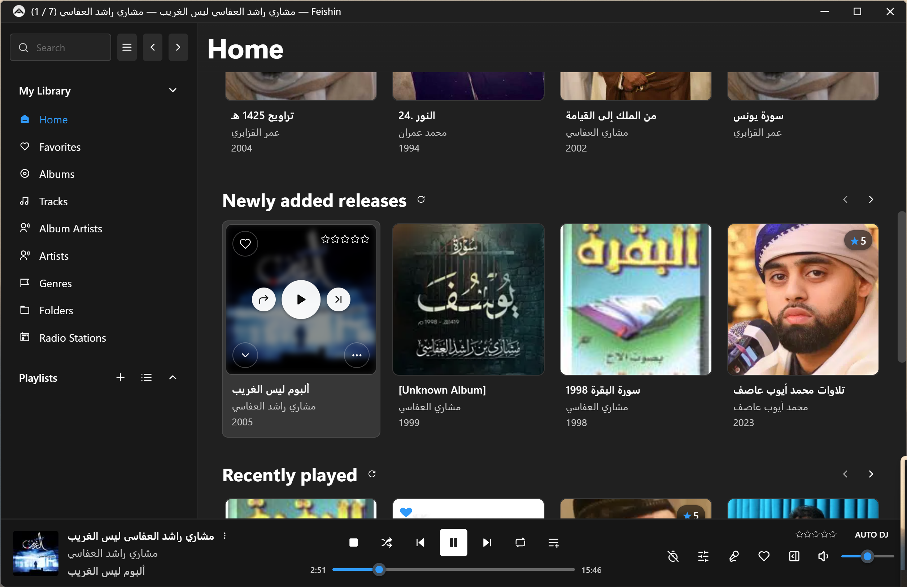
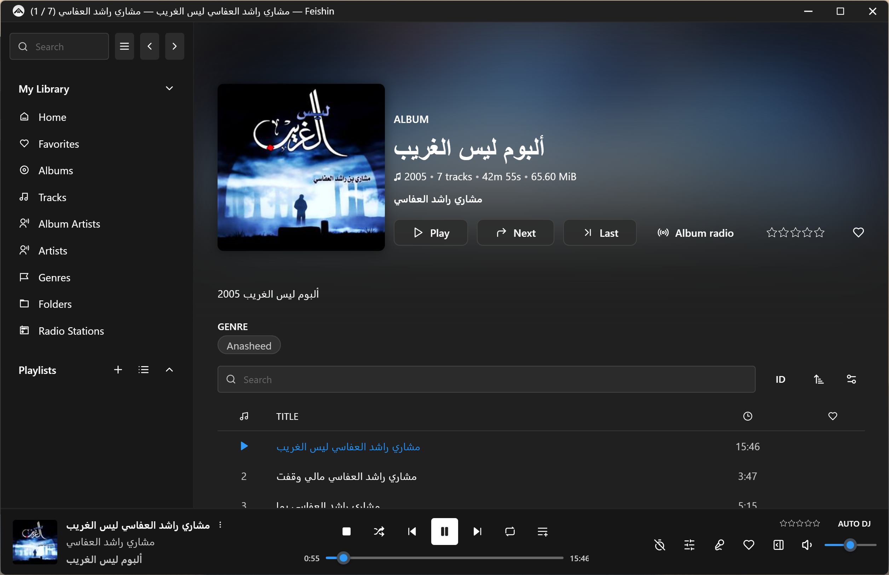

# Feishin Windows 11 Fluent Theme

A custom theme for [Feishin](https://github.com/jeffvli/feishin) that restyles the desktop app to
approximate Windows 11's Fluent design language — Mica/acrylic translucency, Fluent's motion and
elevation scale, Win11-style controls (buttons, inputs, sliders, checkboxes), and a Windows 11
accent-blue palette.

This is a **CSS-only** theme built entirely through Feishin's built-in custom-theme system —
no application source code was modified.

## Screenshots

Home page, with the hover overlay on a grid card (white circular play/share/skip buttons,
heart-shaped favorite badge, star rating pill):

Album detail page, showing the restyled Play/Next/Last/Album radio buttons, sidebar, and player
bar with the Fluent-style seek/volume sliders:

## Installation

Custom themes are **desktop (Electron) only** — not available in the web or Docker builds.

1. Open Feishin, go to **Settings → General → Theme**.
2. Under **Custom Themes**, click **Open Folder** to reveal your Themes directory
   (or navigate there manually):

   | Platform | Path |
   |----------|------|
   | Windows | `%APPDATA%\feishin\Themes` |
   | macOS | `~/Library/Application Support/feishin/Themes` |
   | Linux | `~/.config/feishin/Themes` |

3. Copy the theme files you want from this repo into that folder:
   - **Dark**: `Windows11Fluent.json` + `windows11-fluent.css`
   - **Light (🚧 WIP, see Roadmap)**: `Windows11FluentLight.json` + `windows11-fluent-light.css`
4. Back in Settings, select **"Windows11 Fluent"** (Dark) or **"Windows11 Fluent Light"** (Light)
   from the Theme dropdown. Click **Reload** if it doesn't show up automatically.

## What it does

- **Acrylic/Mica surfaces** — translucent, blurred backgrounds on the player bar, menus, modals,
  tooltips, and popovers, matching Windows 11's material language. Nested flyouts (e.g. a submenu
  rendered inside another menu) fall back to a solid shade instead of stacked blur, since Chromium
  can't compose `backdrop-filter` through an already-filtered ancestor.
- **Fluent 2 motion & elevation** — a `:root` token set (durations, easing curves, shadow scale)
  matching Microsoft's published Fluent 2 design tokens, used consistently for hover/press
  transitions and card elevation.
- **Win11-style controls** — buttons, text inputs, checkboxes, switches, and sliders restyled with
  Fluent's corner-radius scale, borders, and normal/hover/focus/pressed states. Text input focus
  uses a single border-color change rather than a doubled border+outline ring.
- **Native-feeling player controls** — album-card hover overlay (play/share/skip/favorite/options)
  restyled as white circular buttons with elevation, matching native Windows media control
  overlays instead of flat accent-colored fills.
- **Segoe UI Variable** typography, with compensated line-height so its larger vertical metrics
  (needed to support complex scripts) don't clip text in Feishin's fixed-height card/list layouts.

## Known limitations

- **Icons remain Lucide** (Feishin's default icon set), not Fluent System Icons. Swapping the full
  icon set would require adding `@fluentui/react-icons` and touching application source — out of
  scope for a CSS-only theme. See [`docs/icon-swap-notes.md`](docs/icon-swap-notes.md) if you want
  to attempt it.
- **No live wallpaper-derived accent color.** Windows 11's "accent color from background" feature
  reads the OS accent color via `systemPreferences.getAccentColor()` in Electron's main process —
  a CSS/theme-JSON file can't access that. The accent color here is a fixed Windows 11 blue
  (`#0078D4`), not tied to your desktop wallpaper.
- Not all components have been audited yet. If you find something that doesn't match Windows 11
  conventions, please open an issue or PR.

## Roadmap

- [ ] **Light mode — 🚧 WIP.** `Windows11FluentLight.json` + `windows11-fluent-light.css` exist and
      are usable, but this is a rough first pass: app-chrome surfaces (menus, inputs, sidebar,
      dividers) are inverted from light-on-dark to dark-on-light, and overlay elements that sit on
      album art (playback buttons, favorite/rating badges) are intentionally kept identical to
      dark mode. Not yet verified against real content across most views — expect rough edges.
- [ ] Broader component audit (see Known limitations above), covering both light and dark.

Contributions and suggestions welcome — open an issue or PR.

## Credits

- Design reference: [Fluent 2 Design System](https://fluent2.microsoft.design) (Microsoft) — motion
  tokens (duration/easing), elevation/shadow scale, and corner-radius scale are adapted from
  Fluent 2's publicly documented global tokens.
- Built for [Feishin](https://github.com/jeffvli/feishin) by jeffvli, using its documented
  [custom theme system](https://github.com/jeffvli/feishin/blob/development/docs/CUSTOM_THEMES.md).
- Windows 11 is a trademark of Microsoft Corporation. This is an unofficial, community-made theme
  and is not affiliated with or endorsed by Microsoft.

## License

[MIT](LICENSE)
